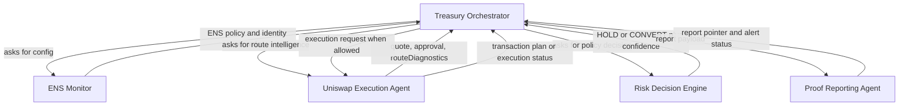
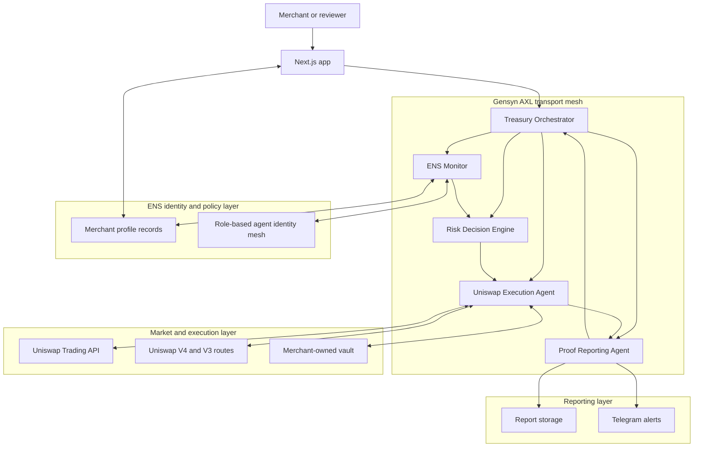
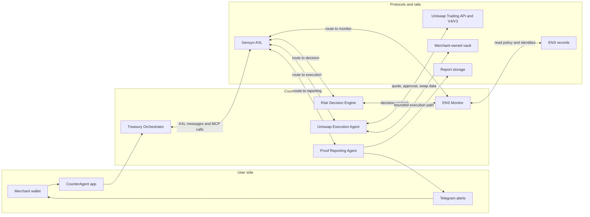
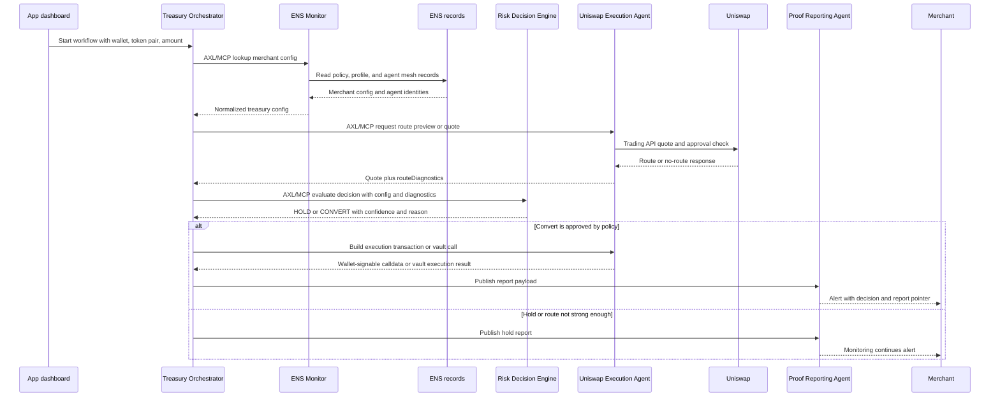
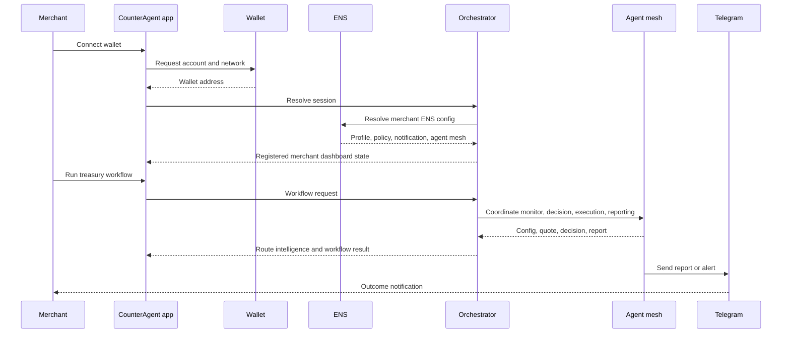
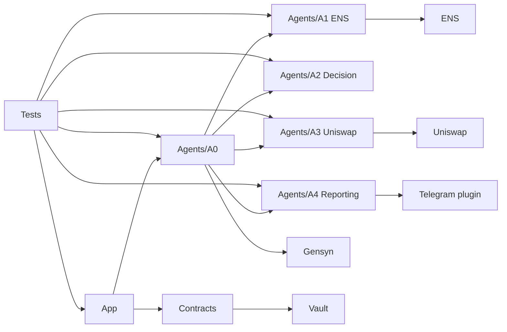

# CounterAgent

Autonomous stablecoin treasury management for merchants on Base and Celo, within rules the merchant controls.

CounterAgent is built for a very practical problem: merchants can receive stablecoins in more than one currency, but converting at the right moment still takes manual work. Someone has to watch balances, compare routes, check fees and slippage, decide whether a conversion is worth it, and keep a record of what happened.

CounterAgent turns that into a five-agent workflow. The app reads the merchant's policy from ENS, asks Uniswap for route intelligence, scores whether to hold or convert, prepares a safe execution path, and publishes a report. The merchant keeps custody and visibility throughout the process.

## The problem

Merchants accepting crypto payments can leak value through poor treasury timing:

- Converting EURC, USDT, cUSD, cEUR, or CELO manually means watching rates and fees.
- Good routes are not always available on every network or testnet.
- Slippage, approvals, and gas can turn a good-looking conversion into a bad one.
- A fully centralized bot creates a trust problem: who controls the policy, the keys, and the audit trail?
- Most apps show a swap button, but not the reasoning behind the swap.

## What CounterAgent does

CounterAgent watches a merchant wallet or vault and runs a bounded treasury workflow:

1. Resolve the merchant's ENS profile, policy, alert destination, and agent identity mesh.
2. Check the requested token pair and amount from the app.
3. Ask Uniswap for route intelligence through the Trading API and V4/V3 route diagnostics.
4. Score the route against merchant policy, risk tolerance, threshold, slippage, gas, and approval requirements.
5. Return a HOLD or CONVERT decision with a readable reason.
6. Prepare wallet-signable calldata or a vault execution path only when policy allows it.
7. Publish the outcome through reporting and alerts.

That is the core product: an autonomous treasury agent that explains its work before it acts.

## What the app proves

| Area | What is implemented | Why it matters |
| --- | --- | --- |
| Agent orchestration | Five role-specific agents coordinated by A0 | Separates monitoring, scoring, execution, and reporting responsibilities |
| Gensyn AXL | Real transport path and tests for agent communication | Shows agent workflow can move beyond local HTTP calls |
| ENS | Merchant config plus role-based agent identity mesh | ENS becomes a service registry, not just a naming layer |
| Uniswap | Trading API first, V4/V3 deterministic routing, route diagnostics, approval checks | Makes execution explainable before a wallet signs anything |
| Vault safety | Merchant-owned vault factory and policy intent flow | Preserves non-custodial design while enabling bounded automation |
| App experience | Dashboard surfaces ENS profile, AXL status, route intelligence, vault plan, reports | Reviewers and operators can see the agent workflow, not just read logs |

## How the workflow feels in the app

A merchant connects a wallet and lands on a dashboard that shows the ENS merchant profile, the role-based agent identity mesh, the AXL transport status, the Uniswap route intelligence panel, and the vault policy model. From there, the merchant can run a treasury workflow and see how each agent contributes.

The important part is visibility. CounterAgent does not simply say “swap” or “do not swap.” It shows the route source, protocols, gas, price impact, approval requirement, fallback reason, decision confidence, and report trail.

The merchant keeps control:

- Configuration lives in ENS records the merchant can inspect and update.
- Funds stay in the merchant wallet or merchant-owned vault.
- The execution agent can only operate within configured limits.
- Every decision is visible in the app and report trail.

This makes the app useful as a product demo and as a technical review surface: the agent workflow is visible, the policy is inspectable, and the execution path is bounded.

## Agent workflow

| Role name | ENS identity | Service | Protocols used | Responsibility |
| --- | --- | --- | --- | --- |
| Treasury Orchestrator | `orchestrator.counteragents.eth` | `counteragent-orchestrator` | App API, Gensyn AXL, MCP-style tool calls | Starts workflows, routes messages, handles recovery |
| ENS Monitor | `monitor.counteragents.eth` | `counteragent-monitor` | ENS, Gensyn AXL, MCP-style lookup | Reads merchant ENS config and watches treasury state |
| Risk Decision Engine | `decision.counteragents.eth` | `counteragent-decision` | Gensyn AXL, route diagnostics, policy scoring | Scores routes, thresholds, risk, and confidence |
| Uniswap Execution Agent | `execution.counteragents.eth` | `counteragent-execution` | Uniswap Trading API, V4/V3, approval checks, vault policy | Builds quotes, approval diagnostics, and swap calldata |
| Proof Reporting Agent | `reporting.counteragents.eth` | `counteragent-reporting` | Report storage, Telegram alerts, Gensyn AXL | Publishes report pointers and merchant alerts |

The public ENS surface uses role names instead of internal A0-A4 labels. This makes the system easier to understand and creates a reusable identity layer for agent discovery.

### What each agent does



## Architecture

### System architecture



### Protocol map by agent



### Agent communication sequence



### User interaction sequence



## ENS: from names to agent identity

CounterAgent uses ENS in two layers.

### Merchant policy records

| ENS record | Purpose |
| --- | --- |
| `counteragent.wallet` | Merchant wallet |
| `counteragent.fx_threshold_bps` | Minimum spread before conversion |
| `counteragent.risk_tolerance` | Conservative, moderate, or aggressive policy |
| `counteragent.preferred_stablecoin` | Preferred output asset |
| `counteragent.telegram_chat_id` | Alert destination |
| `counteragent.registry` | Merchant registry contract |
| `counteragent.subnames` | Agent and service subnames |

### Agent identity mesh

| ENS record | Purpose |
| --- | --- |
| `counteragent.agent_mesh` | Compact JSON index of all role-based agents |
| `counteragent.agent_manifest_uri` | Optional IPFS or HTTPS pointer to full manifest |
| `counteragent.agent.role` | Machine-readable agent role |
| `counteragent.agent.display` | Human-readable role name |
| `counteragent.agent.wallet` | Agent wallet address |
| `counteragent.agent.service` | Service route name |
| `counteragent.agent.endpoint` | Optional public endpoint |
| `counteragent.agent.capabilities` | Agent capability list |
| `counteragent.agent.protocols` | Protocols used by the agent |

Supporting files:

- `ENS/agent-identities.json`
- `ENS/prepare-agent-ens-records.mjs`
- `ENS/test-ens-records-local.sh`

## Uniswap route intelligence

CounterAgent's execution path is Uniswap-first and explainable.

A3 attempts Uniswap Trading API quotes first using deterministic routing preferences. Quote responses include a `routeDiagnostics` object so the app and reports can show:

- route source and routing preference
- chain and token addresses
- protocols used, including V4 and V3
- amount out, minimum amount out, and slippage
- gas estimate and gas fee when available
- price impact and source
- approval requirement and target
- route freshness and quote validity
- fallback reason if no API route is available

When a testnet route is unavailable, CounterAgent does not hide that fact. It displays the attempted API path and falls back to an explicit direct or dry-run route. This is important for technical review because the product is honest about market liquidity while still proving the workflow.

Supporting files:

- `Agents/A3-Execution/Plugin-Uniswap-SwapExecution`
- `Uniswap/README.md`
- `Uniswap/pool-research.md`
- `App/components/dashboard/workflow-evaluation.tsx`

## Gensyn AXL agent transport

CounterAgent has a transport mode for real agent-to-agent communication over Gensyn AXL. The workflow can run with HTTP fallback disabled so the route proves AXL is carrying the agent calls.

Validated surfaces include:

- AXL topology checks
- send and receive checks between agent nodes
- MCP-style calls to A1, A2, A3, and A4 through AXL routes
- A0 workflow execution in `GENSYN_AXL_MODE=transport`
- dashboard status panel for AXL mode, peers, and recent messages

Supporting files:

- `Gensyn/README.md`
- `Gensyn/AXL-EC2-RUNBOOK.md`
- `Gensyn/test-real-axl-p2p.sh`
- `Gensyn/test-real-axl-counteragent-workflow.sh`
- `Agents/test-all-agent-axl-workflow.sh`
- `App/components/dashboard/axl-transport-status.tsx`

## Safety model

CounterAgent is autonomous within merchant-defined limits.

| Control | How it is enforced |
| --- | --- |
| No server custody by default | Browser wallet signs user transactions; server-side custody remains disabled unless vault mode is explicit |
| Merchant-owned vault | Vault is owned by the merchant and can be revoked or withdrawn from by the merchant |
| Policy bounds | Vault policy controls token allowlist, target allowlist, max trade amount, daily limit, slippage, expiration, and active state |
| ENS policy visibility | Merchant settings are readable as ENS records instead of hidden database rows |
| Route transparency | A3 returns route diagnostics before execution |
| Reporting | A4 creates a report and alert path for workflow outcomes |

## App review path

For a reviewer, the fastest path is:

1. Open the app and connect a registered wallet.
2. Confirm the ENS Merchant Profile card resolves merchant records.
3. Review the ENS Agent Identity Mesh card for role-based agent discovery.
4. Run the dashboard workflow dry-run.
5. Inspect Uniswap Route Intelligence for quote source, gas, price impact, approval status, and fallback reason.
6. Check Gensyn AXL Transport for peer status and recent messages.
7. Review Autopilot Vault for the non-custodial policy model.
8. Check Alerts and Analytics for the reporting trail.

## Current app surfaces

| Surface | Purpose |
| --- | --- |
| Landing | Product explanation and wallet entry |
| Onboarding | Merchant registration, ENS setup, Telegram setup, profile records |
| Dashboard | Live workflow, ENS profile, agent identity mesh, AXL status, route intelligence, vault plan |
| Analytics | Savings and volume aggregates from workflow history |
| Alerts | Decision, execution, and report alerts |
| Settings | Merchant policy, ENS media/profile records, notification settings |

The app is implemented with Next.js, React, TypeScript, Tailwind CSS, wagmi, viem, and Dynamic wallet tooling.

## Testnet deployments

Owner wallet: `0x987D68A59a5A2Ff39B723abFaD6678fd22D3510b`

Execution agent / A3: `0xDaa23fF7820b92eA5D78457adc41Cab1af97EbbC`

ENS parent: `counteragents.eth`

| Network | Contract | Address |
| --- | --- | --- |
| Ethereum Sepolia | ENS Registrar Proxy | `0x1e25Aac761220e991DD65f8Cd74045007AbAa445` |
| Ethereum Sepolia | ENS Registrar Implementation | `0xd532D7C9Ddc28d16601FaA5Cc6F54cDABb703C28` |
| Base Sepolia | MerchantRegistry Proxy | `0x9857d987F57607b1e6431Ab94D26a866870b7a3D` |
| Base Sepolia | TreasuryVaultFactory Proxy | `0x6FBbFb4F41b2366B10b93bae5D1a1A4aC3c734BA` |
| Base Sepolia | TreasuryVault Beacon | `0x556Ae9f1451EE58f649DDd896c54170672c31f5D` |
| Base Sepolia | TreasuryVault Implementation | `0x22fB8006F52705B68Ed53cAa7D04494f1a3d556b` |
| Celo Sepolia | MerchantRegistry Proxy | `0x1e25Aac761220e991DD65f8Cd74045007AbAa445` |
| Celo Sepolia | TreasuryVaultFactory Proxy | `0xaD85EC495f8782fC581C0f06e73e4075A7C077E9` |
| Celo Sepolia | TreasuryVault Beacon | `0xc6A8506cfDd83F4E8739D7aB18fCEABfa35fa97A` |
| Celo Sepolia | TreasuryVault Implementation | `0x048F81D4C1bB6256AB17514DD9fc6897BeD91c26` |

Full deployment metadata: `Contracts/deployments/counteragent-testnet.json`.

## Local checks

Run focused checks:

```bash
bash ENS/test-ens-records-local.sh
bash Tests/test-counteragent-services-local.sh
```

Build key plugins:

```bash
npm run build --prefix Agents/A0-Orchestrator/Plugin-CounterAgent
npm run build --prefix Agents/A1-Monitor/Plugin-ENS-MerchantConfig
npm run build --prefix Agents/A2-Decision/Plugin-CounterAgent-DecisionScoring
npm run build --prefix Agents/A3-Execution/Plugin-Uniswap-SwapExecution
npm run build --prefix Agents/A4-Reporting/Plugin-CounterAgent
```

Build the app:

```bash
npm run lint --prefix App
npm run build --prefix App
```

## Repository map

| Path | Description | Review focus |
| --- | --- | --- |
| `App/` | Next.js web app for onboarding, dashboard, analytics, alerts, and settings | Shows the live product surface and workflow evidence |
| `App/components/dashboard/` | Dashboard cards for ENS profile, ENS agent mesh, AXL transport, route intelligence, vault, activity, and KPIs | Main UI review area |
| `App/lib/a0.ts` | Frontend API client and shared response types for A0, ENS records, workflow, vault, dashboard state, and AXL status | Confirms app data contracts |
| `Agents/A0-Orchestrator/Plugin-CounterAgent/` | App-facing orchestrator and workflow coordinator | Starts workflows and routes calls to A1-A4 |
| `Agents/A1-Monitor/Plugin-ENS-MerchantConfig/` | ENS monitor/config plugin | Reads merchant ENS records and prepares agent identity records |
| `Agents/A2-Decision/Plugin-CounterAgent-DecisionScoring/` | Decision scoring service | Converts route diagnostics and policy into HOLD or CONVERT |
| `Agents/A3-Execution/Plugin-Uniswap-SwapExecution/` | Uniswap quote, approval, swap, and route diagnostics service | Core Uniswap integration |
| `Agents/A4-Reporting/Plugin-CounterAgent/` | Report publishing service | Creates workflow report payloads and storage pointers |
| `Agents/A4-Reporting/Plugin-Telegram-Alerts/` | Telegram alert service | Sends merchant notifications after reports |
| `Agents/openclaw/` | OpenClaw deployment templates and scripts | Shows how services are packaged and run |
| `Contracts/` | Solidity contracts, Foundry tests, deployment scripts, and deployment metadata | Merchant registry, ENS registrar, vault factory, and vault policy layer |
| `ENS/` | ENS documentation, agent identity manifest, record preparation script, local ENS tests | ENS merchant config and role-based agent identity mesh |
| `Gensyn/` | AXL transport scripts, real-node checks, and runbook | Verifies agent communication over Gensyn AXL |
| `Uniswap/` | Uniswap setup, pool tooling, route research, and local pool docs | Explains route setup and fallback path |
| `Vault/` | Non-custodial vault architecture notes | Explains bounded autonomous execution model |
| `Tests/` | Local workflow and service smoke tests | Fast reproducible validation before PR review |
| `docs/` | Internal project notes and design context | Supporting design material; not required for app operation |

### Directory relationship diagram



## Why this matters beyond the demo

CounterAgent starts with a specific pain: merchants accepting stablecoins need treasury decisions that are faster and safer than manual conversion. The same architecture can expand into broader autonomous finance operations:

- recurring treasury rebalancing
- cross-chain stablecoin policy routing
- agent-to-agent payment operations
- compliance-aware audit trails
- merchant-controlled automation marketplaces

The defensible layer is not a single swap. It is the combination of merchant-owned policy, verifiable agent identity, explainable route intelligence, and auditable execution.

## License

MIT
