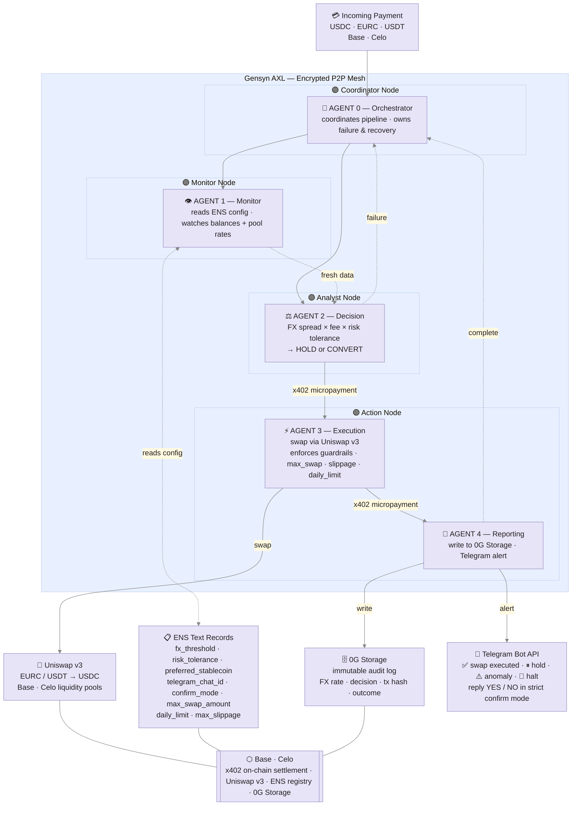

# CounterAgent 🦩

> **Autonomous stablecoin treasury management for merchants on Base — within guardrails you control. No backend. No rogue behaviour. No value lost to bad FX timing.**

[](https://ethglobal.com/events/openagents)
[](https://base.org)
[](LICENSE)

---

## The Problem

Merchants accepting crypto payments leak value every day to poor FX timing:

- Converting EURC → USDC manually means watching rates, calculating fees, and still getting it wrong
- No existing tool monitors FX spreads continuously and acts autonomously
- Every solution requires a centralised server — one point of failure, one point of trust
- Automated responses execute without consensus — wrong actions cost real money
- In 2024–2025, merchants lost significant value simply by converting at the wrong moment

---

## The Solution

CounterAgent is a 5-agent autonomous system that watches your wallet, scores live FX rates, and converts stablecoins at the optimal moment via Uniswap v3 — with **x402 micropayments settling every inter-agent step on-chain**. Agents communicate over a **Gensyn AXL encrypted P2P mesh** — no central server, no single point of failure. You get a Telegram alert when it happens.

Agents are distributed across **4 AXL nodes**, each with a distinct role:

| AXL Node | Role | Responsibility |
|---|---|---|
| **Coordinator** | Agent 0 — Orchestrator | Pipeline control, failure handling, recovery |
| **Monitor** | Agent 1 — Monitor | ENS config reads, wallet + pool rate polling |
| **Analyst** | Agent 2 — Decision | FX scoring, HOLD / CONVERT determination |
| **Action** | Agent 3 + 4 — Execution & Reporting | Swap execution, 0G audit log, Telegram alert |

1. **Agent 0 (Orchestrator)** — coordinates all agents via AXL, owns failure and recovery decisions
2. **Agent 1 (Monitor)** — reads ENS config, watches wallet balances and Uniswap pool rates in real time
3. **Agent 2 (Decision)** — runs hold/convert scoring logic weighted by FX spread, fee, and risk tolerance
4. **Agent 3 (Execution)** — submits swaps via Uniswap v3 on Base and Celo; enforces guardrails (max_swap_amount, daily_limit, max_slippage); x402 handles inter-agent payment settlement
5. **Agent 4 (Reporting)** — logs every decision to 0G Storage; sends Telegram alert to merchant

---

## Architecture



All agents are **bidirectional** — failures propagate back through the pipeline (Execution → Decision → Orchestrator) rather than silently dropping.

Every inter-agent step settles via **x402 micropayments on Base** — agents pay each other on-chain, making the entire pipeline verifiably trustless with no off-chain coordination.

---

## Partner Integrations

### Gensyn AXL — Encrypted Agent Transport Layer
All inter-agent communication runs over Gensyn's AXL encrypted P2P mesh. CounterAgent deploys across **4 AXL nodes** — Coordinator, Monitor, Analyst, and Action — each running a distinct part of the pipeline. No centralised message broker, no single point of failure, no off-chain trust assumptions. Agents discover each other via the AXL registry and communicate over encrypted channels regardless of where each node is hosted.

| AXL Node | Agents | Function |
|---|---|---|
| Coordinator | Agent 0 | Orchestrate pipeline, handle failures |
| Monitor | Agent 1 | Poll ENS config and Uniswap pool rates |
| Analyst | Agent 2 | Score FX opportunity, issue HOLD/CONVERT |
| Action | Agent 3 + 4 | Execute swap, log to 0G, alert merchant |

### x402 — Inter-Agent Payment Settlement
Each agent-to-agent handoff in the pipeline is settled via x402 micropayments on Base. When Agent 2 signals Agent 3 to execute, that instruction carries an on-chain payment — no off-chain trust required. The full pipeline is economically self-contained and auditable end-to-end.

### ENS — Decentralised Config Store
Each merchant stores treasury configuration in ENS text records — one setup step, fully self-custodial, no centralised database:

| ENS Text Record | Value |
|---|---|
| `counteragent.fx_threshold` | `0.005` (0.5%) |
| `counteragent.risk_tolerance` | `moderate` |
| `counteragent.preferred_stablecoin` | `USDC` |
| `counteragent.telegram_chat_id` | `@merchantchat` |

Config is readable at runtime by Agent 1 — merchants update settings without touching any app.

The full ENS config schema including guardrails:

| ENS Text Record | Example | Purpose |
|---|---|---|
| `counteragent.fx_threshold` | `0.005` | Minimum spread (0.5%) to trigger conversion |
| `counteragent.risk_tolerance` | `moderate` | low / moderate / high |
| `counteragent.preferred_stablecoin` | `USDC` | Target token |
| `counteragent.telegram_chat_id` | `@merchantchat` | Alert + confirmation destination |
| `counteragent.confirm_mode` | `strict` | `strict` = require Telegram YES · `auto` = execute after timeout |
| `counteragent.max_swap_amount` | `500` | Hard cap per single transaction (USDC) |
| `counteragent.daily_limit` | `2000` | Maximum total swapped per 24h |
| `counteragent.max_slippage` | `0.003` | Reject swap if slippage exceeds 0.3% |

### Uniswap v3 — Swap Execution
Agent 3 executes swaps across Base and Celo liquidity pools:

| Pair | Network | Pool |
|---|---|---|
| EURC → USDC | Base | Uniswap v3 |
| USDT → USDC | Base | Uniswap v3 |
| USDC → EURC | Base | Uniswap v3 |
| cEUR → cUSD | Celo | Uniswap v3 |
| cKES → cUSD | Celo | Uniswap v3 |
| cGHS → cUSD | Celo | Uniswap v3 |

### 0G Storage — Immutable Audit Log
Every consensus round writes to 0G:
- Proposal data (FX rate, spread, tx hash)
- Agent decision (HOLD / CONVERT + reasoning)
- Execution result (swap hash, rate achieved, fee paid)
- Final outcome with timestamps

Verifiable on [storagescan.0g.ai](https://storagescan.0g.ai)

### Telegram Bot API — Merchant Alerts & Confirmations
Telegram is **bidirectional** — merchants receive alerts *and* approve swaps. In `strict` confirm mode, no swap ever executes without an explicit YES from the merchant's phone.

**Outbound alerts:**

| Trigger | Alert |
|---|---|
| 🔔 Swap pending confirmation | Amount, rate, estimated saving — reply YES / NO |
| ✅ Swap executed | Amount, rate achieved, fee saved vs card rails |
| ⏸ Hold decision | Rate below threshold, monitoring continues |
| 📊 FX approaching threshold | Heads-up before action |
| ⚠️ Anomaly detected | Execution paused, review required |
| 🛑 Critical halt | Agent 0 emergency stop |

**Example confirmation message:**
```
🔔 CounterAgent wants to swap
800 EURC → USDC @ 1.0812
Saves $4.20 vs Stripe FX · Fee 0.05%

Reply ✅ YES to confirm
Reply ❌ NO to cancel
Auto-executes in 15 min if no reply (auto mode only)
```

---

## Safety & Guardrails

CounterAgent is an *autonomous-within-limits* agent. Every guardrail is set by the merchant in their ENS config — the agent cannot exceed them under any circumstances.

### Autopilot Treasury Vault

The first Autopilot Vault slice adds a merchant-owned, non-custodial contract foundation in
`Contracts/src/CounterAgentTreasuryVault.sol` plus `CounterAgentTreasuryVaultFactory.sol`. The merchant owns the vault, deposits ERC20 funds
directly, and can revoke policy or withdraw at any time. A0 only prepares a draft policy intent from
`POST /vault/plan`; it does not receive keys, custody funds, or require a deployed vault address.
For no-human-in-the-loop execution, the intended authorized executor is A3 (`A3-Uniswap-SwapExecution`)
through the configured `EXECUTION_AGENT_ADDRESS`, not the web app or A0 server.

The vault enforces the merchant's bounded permission on-chain before agent execution:

- approved stablecoin allowlist: Base (USDC, EURC, USDT) and Celo (cUSD, cEUR, cREAL, cKES, cCOP, cGHS)
- approved target allowlist, for example a future Uniswap adapter or KeeperHub target
- `maxTradeAmount`
- `dailyLimit`
- `maxSlippageBps`
- `expiresAt`
- active or revoked policy state

A factory creates one deterministic minimal-proxy/clone vault per merchant wallet. We will deploy one factory per supported testnet first: Base Sepolia and Celo Sepolia; mainnet follows after review. The first implementation intentionally uses a generic whitelisted `executeCall` guard rather than a
direct router integration. This keeps the custody and policy boundary auditable while leaving room
for a dedicated swap adapter in a later slice.

**What CounterAgent can do:**
- Swap between approved stablecoins on Base (USDC · EURC · USDT) and Celo (cUSD · cEUR · cREAL · cKES · cCOP · cGHS)
- Read your ENS configuration at runtime
- Send Telegram alerts and confirmation requests
- Log every decision and outcome to 0G Storage

**What CounterAgent can never do:**
- Send funds to any wallet outside the merchant's own address
- Swap above the `max_swap_amount` per transaction
- Exceed the `daily_limit` across all swaps in 24 hours
- Execute if slippage exceeds `max_slippage`
- Execute in `strict` mode without an explicit Telegram YES

**Circuit breakers — Agent 0 halts the pipeline if:**
- The live rate deviates more than 2% from the 7-day average (anomaly detection)
- 3 consecutive execution failures occur
- Slippage on the proposed swap exceeds the merchant's configured maximum
- No valid ENS config is found for the wallet

All halts are logged to 0G Storage with timestamp and reason. The merchant receives a 🛑 Telegram alert and must manually resume.

---

## How It Works — Step by Step

1. Merchant wallet receives USDC, EURC, or USDT on Base
2. Coordinator Node (Agent 0) initiates pipeline over Gensyn AXL mesh
3. Monitor Node (Agent 1) reads ENS text records for merchant config
4. Monitor Node polls Uniswap v3 pool rates continuously via AXL
5. When spread exceeds threshold → AXL message sent to Analyst Node
6. Analyst Node (Agent 2) scores: FX rate × swap fee × risk tolerance → HOLD or CONVERT
7. If CONVERT → x402 micropayment triggers Action Node (Agent 3)
8. Agent 3 submits swap via Uniswap v3 on Base or Celo; enforces guardrails before execution
9. x402 micropayment triggers Agent 4 (Reporting) on Action Node
10. Agent 4 writes decision + result to 0G Storage
11. Agent 4 fires Telegram alert to merchant
12. Completion reported back to Coordinator Node (Agent 0) via AXL

---

## Tech Stack

| Layer | Technology |
|---|---|
| Agent Framework | Claude Agent SDK (Anthropic) |
| AI Models | Claude Sonnet 4.6 |
| Networks | Base (Ethereum L2) · Celo |
| Agent Transport | Gensyn AXL (encrypted P2P mesh · 4 nodes) |
| Inter-Agent Payments | x402 micropayments (on-chain settlement) |
| Swap Execution | Uniswap v3 |
| Config Store | ENS Text Records (on-chain) |
| Audit Log | 0G Storage |
| Merchant Alerts | Telegram Bot API |
| Frontend | React + TypeScript + Vite |
| Stablecoins | USDC · EURC · USDT (Base) · cUSD · cEUR · cKES · cGHS · eXOF (Celo) |

---

## Supported Stablecoins

CounterAgent operates on both Base and Celo, giving merchants access to global and regional stablecoins.

**Base**

| Token | Issuer | Peg |
|---|---|---|
| USDC | Circle | US Dollar |
| EURC | Circle | Euro |
| USDT | Tether | US Dollar |

**Celo**

| Token | Issuer | Peg |
|---|---|---|
| cUSD | Mento | US Dollar |
| cEUR | Mento | Euro |
| cKES | Mento | Kenyan Shilling |
| cGHS | Mento | Ghanaian Cedi |
| eXOF | Mento | West African CFA Franc |

> **Why both networks?** Base gives us deep USDC/EURC liquidity and x402 settlement. Celo gives us Mento-issued regional stablecoins — cKES, cGHS, eXOF — that are essential for African merchants receiving payments in local currency pegs. CounterAgent is the only autonomous treasury tool that bridges both.

---

## Telegram Alerts

Merchants store their Telegram chat ID in their ENS text record (`counteragent.telegram_chat_id`). Zero extra setup. Example alert:

```
✅ CounterAgent executed swap
800 EURC → USDC @ 1.0812
Saved $4.20 vs Stripe FX
Fee: 0.05% | Logged to 0G
```

---

## Mobile UI

CounterAgent is mobile-first — the natural entry point is the Telegram notification on your phone.

**Color palette:** Flamingo `#FF5CB9` (primary) · Citrus `#FF9700` (accent) · Charcoal `#231F20` (text)

<p align="center">
  <a href="https://admirable-panda-65cc61.netlify.app/"><strong>📱 View all 6 screens — Live Mockup →</strong></a>
</p>

**6 screens:** Landing · Dashboard · Onboarding · Analytics · Alerts · Settings

| Screen | Description |
|---|---|
| Landing | Hero, CTA, Base / Celo network selector, partner badges (Uniswap · Gensyn AXL · ENS · 0G) |
| Dashboard | Balance hero card, token holdings, savings vs Stripe FX, guardrails status, agent activity log |
| Onboarding | 6-step wizard: ENS wallet → network + stablecoin → FX threshold → guardrails (spending cap, daily limit, slippage, confirm mode) → Telegram ID → review |
| Analytics | Cumulative savings chart, stats grid, pair breakdown by volume (Base + Celo pools) |
| Alerts | Telegram status banner, pending swap confirmation (YES / NO), full alert feed with severity badges |
| Settings | Wallet card, treasury guardrail config with ENS field names, network toggle, notification preferences |

---

## Quick Start

```bash
git clone https://github.com/JulioMCruz/CounterAgent
cd CounterAgent
npm install
cp .env.example .env
# Add API keys: Anthropic, Telegram Bot, 0G
npm run dev
```

### Environment Variables

```env
ANTHROPIC_API_KEY=
TELEGRAM_BOT_TOKEN=
ZERO_G_API_KEY=
BASE_RPC_URL=
CELO_RPC_URL=
```

---

## Prizes Targeting

| Sponsor | Prize | Integration |
|---|---|---|
| Uniswap Foundation | $5,000 | Swap execution via Uniswap v3 on Base · EURC/USDC · USDT/USDC · USDC/EURC |
| Gensyn | $5,000 | AXL encrypted P2P mesh as agent transport layer across 4 distinct nodes |
| ENS | $4,000 | Best ENS Integration for AI Agents · on-chain merchant config + guardrails via 8 ENS text records |
| 0G Labs | — | Immutable decentralised audit log for every decision and swap |

---

## Team

Built at **ETHGlobal Open Agents 2026** — April 24 to May 3, 2026

| Name | Role | Contact |
|---|---|---|
| Abena | Product & Research | [@abena_eth](https://twitter.com/abena_eth) · abena@bluewin.ch |
| Julio M Cruz | Engineering | [GitHub: JulioMCruz](https://github.com/JulioMCruz) |

---

## Contact

- Twitter/X: [@abena_eth](https://twitter.com/abena_eth)
- GitHub: [JulioMCruz/CounterAgent](https://github.com/JulioMCruz/CounterAgent)
- ETHGlobal: [Open Agents 2026](https://ethglobal.com/events/openagents)


## Next Mainnet Step

Before mainnet, rename the public ENS surface from `counteragents.eth` to `counteragents.eth`/`counteragents.eth` in product copy and ENS provisioning configuration, then deploy factories on Base and Celo mainnet.

### Upgradeability

All CounterAgent contracts are now aligned to OpenZeppelin upgradeability patterns:

- `MerchantRegistry`: UUPS upgradeable behind `ERC1967Proxy`.
- `CounterAgentENSRegistrar`: UUPS upgradeable behind `ERC1967Proxy`.
- `CounterAgentTreasuryVaultFactory`: UUPS upgradeable behind `ERC1967Proxy`.
- Merchant vaults: `BeaconProxy` instances owned/configured by the merchant, with implementation upgrades routed through an OpenZeppelin `UpgradeableBeacon` owned by the factory.

## Testnet Deployments — Counter Agents

Owner wallet: `0x987D68A59a5A2Ff39B723abFaD6678fd22D3510b`  
Execution agent / A3: `0xDaa23fF7820b92eA5D78457adc41Cab1af97EbbC`  
ENS parent: `counteragents.eth`

| Network | Contract | Address |
| --- | --- | --- |
| Ethereum Sepolia | ENS Registrar Proxy | `0x1e25Aac761220e991DD65f8Cd74045007AbAa445` |
| Ethereum Sepolia | ENS Registrar Implementation | `0xd532D7C9Ddc28d16601FaA5Cc6F54cDABb703C28` |
| Base Sepolia | MerchantRegistry Proxy | `0x9857d987F57607b1e6431Ab94D26a866870b7a3D` |
| Base Sepolia | TreasuryVaultFactory Proxy | `0x6FBbFb4F41b2366B10b93bae5D1a1A4aC3c734BA` |
| Base Sepolia | TreasuryVault Beacon | `0x556Ae9f1451EE58f649DDd896c54170672c31f5D` |
| Base Sepolia | TreasuryVault Implementation | `0x22fB8006F52705B68Ed53cAa7D04494f1a3d556b` |
| Celo Sepolia | MerchantRegistry Proxy | `0x1e25Aac761220e991DD65f8Cd74045007AbAa445` |
| Celo Sepolia | TreasuryVaultFactory Proxy | `0xaD85EC495f8782fC581C0f06e73e4075A7C077E9` |
| Celo Sepolia | TreasuryVault Beacon | `0xc6A8506cfDd83F4E8739D7aB18fCEABfa35fa97A` |
| Celo Sepolia | TreasuryVault Implementation | `0x048F81D4C1bB6256AB17514DD9fc6897BeD91c26` |

Full machine-readable deployment metadata: `Contracts/deployments/counteragent-testnet.json`.
