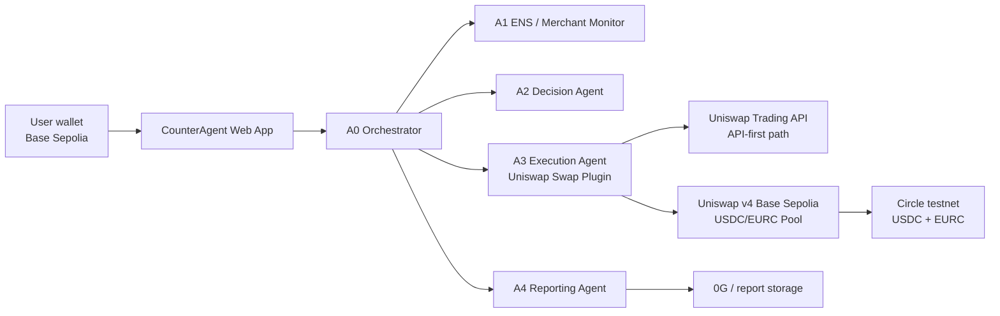
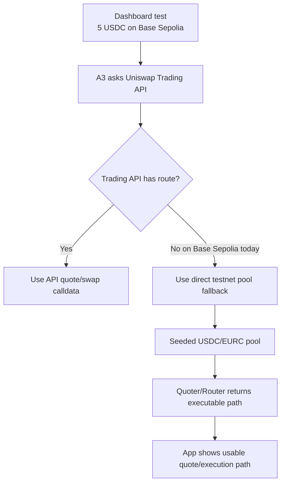
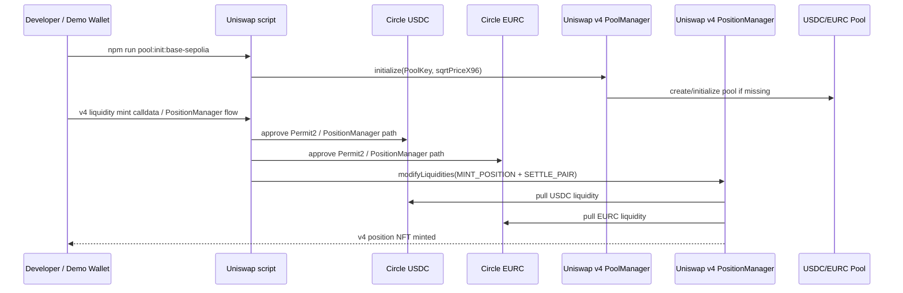
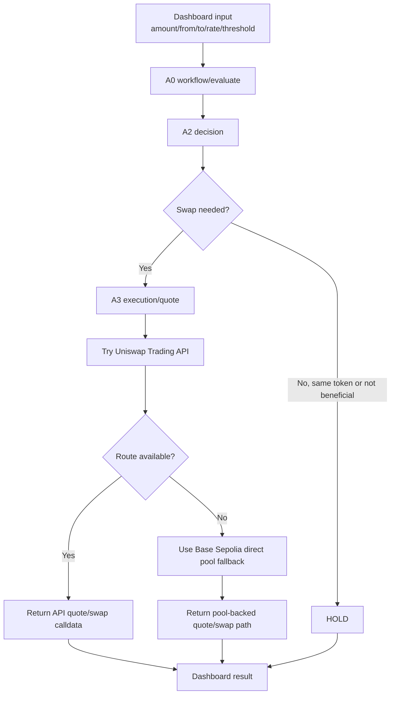

# CounterAgent Uniswap Tools

This folder contains the reproducible Uniswap setup for the CounterAgent Base Sepolia demo.

It is intentionally committed to GitHub so judges/builders can see how the pool is created, how liquidity is seeded, and how the CounterAgent app uses the pool through the A3 execution agent.

> Safety: `.env`, private keys, and real secrets must stay local. Never commit wallet keys.

## What this folder does

- Verifies the official Circle testnet USDC/EURC contracts on Base Sepolia.
- Prepares or sends transactions to create a Uniswap testnet pool.
- Seeds USDC/EURC liquidity for the demo wallet.
- Documents how the pool connects back to the CounterAgent app and A3 execution plugin.

## Base Sepolia token addresses

Circle testnet tokens:

| Token | Base Sepolia address | Decimals |
| --- | --- | --- |
| USDC | `0x036CbD53842c5426634e7929541eC2318f3dCF7e` | 6 |
| EURC | `0x808456652fdb597867f38412077A9182bf77359F` | 6 |

## Uniswap Base Sepolia contracts

### Uniswap v4 — primary for this demo

| Contract | Address |
| --- | --- |
| PoolManager | `0x05E73354cFDd6745C338b50BcFDfA3Aa6fA03408` |
| PositionManager | `0x4b2c77d209d3405f41a037ec6c77f7f5b8e2ca80` |
| Universal Router | `0x492e6456d9528771018deb9e87ef7750ef184104` |
| Quoter | `0x4a6513c898fe1b2d0e78d3b0e0a4a151589b1cba` |

## Architecture

### High-level app flow



### Why the pool is needed



Current observed behavior: Uniswap Trading API is reached successfully, but for Base Sepolia Circle EURC/USDC it can return `404 No quotes available`. The seeded pool gives us a controllable testnet route for the app while keeping the production architecture API-first.

### Pool creation flow



### Runtime quote/execution decision



## Setup

```bash
cd Uniswap
cp .env.example .env
npm install
```

Edit `.env` locally. Do not commit it.

Minimum useful local config:

```env
BASE_SEPOLIA_RPC_URL=https://sepolia.base.org
WALLET_ADDRESS=0xYourWallet
LIQUIDITY_RECIPIENT=0xYourWallet
```

If you want the script to actually send transactions, add a local-only testnet private key:

```env
BASE_SEPOLIA_PRIVATE_KEY=0x...
```

## Verify tokens and balances

```bash
npm run verify:base-sepolia
```

This checks:

- Base Sepolia RPC connectivity
- token bytecode exists
- token `name`, `symbol`, and `decimals`
- optional wallet balances when `WALLET_ADDRESS` is set

Expected Circle metadata:

- USDC: symbol `USDC`, decimals `6`
- EURC: symbol `EURC`, decimals `6`

## Create the Uniswap v4 pool and seed liquidity

Current verified wallet for the demo:

```text
0x987D68A59a5A2Ff39B723abFaD6678fd22D3510b
```

Verified on Base Sepolia:

| Asset | Balance |
| --- | ---: |
| ETH | `0.699992656745603657` |
| USDC | `80` |
| EURC | `70` |

Recommended demo settings:

```env
WALLET_ADDRESS=0x987D68A59a5A2Ff39B723abFaD6678fd22D3510b
LIQUIDITY_RECIPIENT=0x987D68A59a5A2Ff39B723abFaD6678fd22D3510b
V4_POOL_FEE=500
V4_TICK_SPACING=10
LIQUIDITY_USDC=45
LIQUIDITY_EURC=45
INITIAL_PRICE_TOKEN1_PER_TOKEN0=1
```

`500` means the `0.05%` fee tier.

`45 USDC + 45 EURC` leaves a buffer from the verified wallet balances instead of consuming the entire testnet balance.

### Dry run

```bash
npm run pool:init:base-sepolia
```

Without `BASE_SEPOLIA_PRIVATE_KEY`, the script does not send transactions. It prints calldata for the Uniswap v4 `PoolManager.initialize(PoolKey, sqrtPriceX96)` call.

### Execute on-chain

Only after reviewing the dry run, set the local key and run again. Do not paste the key in chat and do not commit it.

```env
BASE_SEPOLIA_PRIVATE_KEY=0x...
```

```bash
npm run pool:init:base-sepolia
```

The script will send the v4 pool initialization transaction and print the BaseScan link.

Liquidity minting for v4 goes through `PositionManager.modifyLiquidities(MINT_POSITION + SETTLE_PAIR)`. The helper reads the current pool tick from `StateView`, uses explicit nonces, and sends the Permit2 approvals plus the PositionManager mint flow using the same wallet.

```bash
npm run pool:add-liquidity-v4:base-sepolia
```

## How the app uses this pool

The app does not talk to this folder directly at runtime. This folder is setup tooling.

Runtime path:

1. User opens the CounterAgent dashboard.
2. User chooses amount/from-token/to-token on Base Sepolia.
3. App calls A0 `/workflow/evaluate`.
4. A0 asks A2 whether conversion is needed.
5. A0 asks A3 for a quote/execution path.
6. A3 tries Uniswap Trading API first.
7. If the API has no Base Sepolia route, A3 can use the direct Base Sepolia pool fallback.
8. The dashboard displays the quote/decision/execution metadata.

The token addresses used by A3 must match this pool:

```env
CHAIN_ID=84532
UNISWAP_QUOTE_MODE=api-first
USDC_TOKEN_ADDRESS_84532=0x036CbD53842c5426634e7929541eC2318f3dCF7e
EURC_TOKEN_ADDRESS_84532=0x808456652fdb597867f38412077A9182bf77359F
```

For the direct pool fallback, A3 should also know the Uniswap v4 quoter/pool params:

```env
V4_QUOTER_84532=0x4a6513c898fe1b2d0e78d3b0e0a4a151589b1cba
V4_POOL_FEE=500
V4_TICK_SPACING=10
V4_HOOKS_84532=0x0000000000000000000000000000000000000000
```

## Important notes

- If the user selects `USDC -> USDC`, the app should return `HOLD`; no swap is needed.
- For a visible swap demo, use `USDC -> EURC` or `EURC -> USDC`.
- The Uniswap Trading API path remains the primary integration.
- The seeded Base Sepolia pool is the fallback/demo path when the Trading API has no testnet route.
- Testnet USDC/EURC have no real financial value, but private keys still must not be committed or pasted into chat.

## Script list

| Command | Purpose |
| --- | --- |
| `npm run verify:base-sepolia` | Verify Circle token contracts and optional wallet balances |
| `npm run pool:init:base-sepolia` | Prepare/send Uniswap v4 pool initialization calldata |
| `npm run pool:add-liquidity-v4:base-sepolia` | Prepare/send v4 PositionManager liquidity mint flow |
